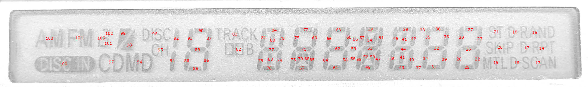

# Sanyo LC75853N Experiment

The stock tape deck from a 1998 Toyota Camry LE (86120-08010) was taken apart
and I learned how to control the faceplate circuit board independent of the
original tape deck mainboard. That faceplate consisted of a custom segmented
LCD screen, two knobs, an array of buttons, and a Sanyo LC75853 LCD driver
that manages most of the faceplate components.

The main writeup is on https://newscrewdriver.com. All the posts related to
the tape deck faceplate are tagged
[with 86120-08010](https://newscrewdriver.com/tag/86120-08010/). This
repository hosts some of the related bits of information.

* `Sanyo_LC75853N.ino`: An Arduino sketch that runs on an Arduino Nano and
can communicate with the Sanyo LC75853N to read keyscan data and set LCD
segment state. This is a simple exploratory program and not polished.
Feel free to use it for comparison. But if you actually copy/paste code from
this quick-and-dirty hack, a reminder MIT license says AS-IS and NO WARRANTY.
  * Larson Scanner. [see this Tweet for video](https://twitter.com/Regorlas/status/1526424801404850176).
  * Segment map tool. Audio Mode knob clockwise/counterclockwise to select
different segments, push the knob to goggle that segment on/off. The
LCD control bit pattern for the current pattern (in format easily copied
into C code) is printed to Arduino serial port. This was the tool used
to generate Larson Scanner patterns.
* `LC75853N_startup.sal`: Sanyo CCB communication data captured between
original mainboard and faceplate by Saleae Logic 8 analyzer. This time
period includes initial power-up and a few events noted via timer markers
in the capture file. Download
[Saleae's Logic 2 software](https://www.saleae.com/downloads/) to read this
file. As of version 2.3.53, it is not necessary to have Saleae logic analyzer
hardware in order to run their software. If you need a logic analyzer,
I've been happy with my Saleae and can recommend them. (Not paid promotion)
* `LCD_segment_map.jpg`: Diagram labeling each LCD segment with their
corresponding LC75853N segment number. (A subset of the full D1-D126
as per datasheet.)

* `key_data_map.jpg`: Diagram labeling each button on the faceplate
with their corresponding LC75853N key data number. (A subset of the
full KD1-KD30 as per datasheet.)

---

There were two PDF files that I found valuable, but will not host in this
repository due to copyright concerns. Search the internet to find them
hosted by people less worried about such legalities.
* Sanyo Semiconductors Data Sheet: _CCB (Computer Control Bus) IC I/F
Serial Bus Format._
* Sanyo Semiconductors Data Sheet: _LC75853NE, 75853NW 1/3 Duty LCD Display
Drivers with Key Input Function_.
